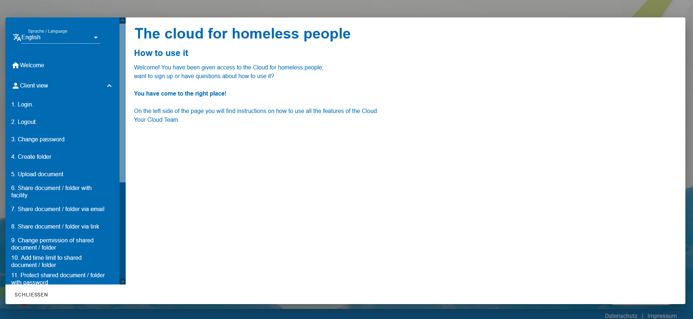

<p align="center"><a target="_blank" rel="noopener noreferrer"></a></p>

# Simple HELPPAGE
Vue JS frontend of a simple help page. Here screenshots and process steps could be easily included. This help page can be easily embedded as an iframe. This helppage was developed within the context of the EU project *"Cloud for homeless people"* of the [AGJ-Fachverband Freiburg](https://agj-freiburg.de). 


# Look


# Contributors
| TASK                  | PERSONS                                                          | 
| -------------         |-------------:                                                    | 
| Project lead          | Moritz Bross, Robin Haensse                                      |
| Design                | Bernhard Ruchti                                                  | 
| Programming           | Bernhard Ruchti                                                  | 
| Multilanguage         | Bernhard Ruchti                                                  | 


## Contact
1. [AGJ-Freiburg](https://agj-freiburg.de/kontaktformular)
2. the developers using "Issues"


## How to use
1. clone this repository
2. ```npm install```
3. ```npm run build```
4. use dist folder to server website


